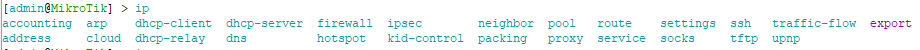
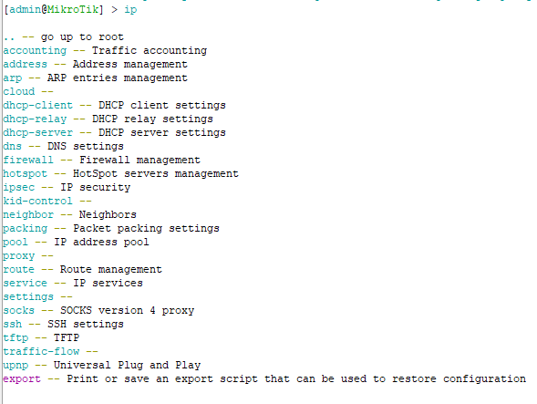

# LAB-4
Selasa 12 Agustus 2025

# Command Line Interface (CLI) pada Mikrotik 
  Selain GUI, untuk konfig Mikrotik juga bisa mengunakan CLI atau Terminal. Yang dapat di akses di winbox terminal, webfig terminal, putty, dan Mikrotik Pro untuk smartphone. Jika mesih bingung dengan command-commandnya, cukup melihat ke GUI winboxnya, contoh, kita ingin set IP DHCP Client untuk ether1, kita lupa command nya apa, kita tinggal melihat ke GUI saja, IP DHCP Client di GUI ada di  
**IP > DHCP Client**  
berarti commandnya

    ip dhcp-client 
dan untuk menambahkan IP DHCP-Client di GUI  
**IP > DHCP-Client > Add/+ > Interface=ether1 > [V] use peer dns > [V] use peer ntp > add default route=yes > enable [V]**  
berarti kalo di CLI

    ip dhcp-client add interface=ether1 use-peer-dns=yes use-peer-ntp=yes add-default-route=yes disabled=no
Berbeda dengan Terminal Linux dan Windows, di terminal RouterOS, kita bisa menyingkat command, seperti

    ip address print
Bisa disingkat jadi

    ip add pr
Untuk masuk/keluar direktory, disini saya akan masuk ke **IP** berarti

    ip
Nanti berubah menjadi  

    [admin@mikrotik] /ip >  
Yang berarti kita sudah masuk ke ip, dan untuk kembali kita bisa mengunakan **/** (slash) lalu enter,  

    /  
dan nanti akan berubah lagi menjadi  

    [admin@mikrotik] >  
yang artinya kita sudah diluar/root.  
# Melihat Command yang tersedia
Selain itu, kita juga bisa mengunakan key/tombol **TAB** di keyboard (disamping **Q**) untuk melihat command list/daftar perintah yang bisa digunakan. Jadi jika kita sedang konfigurasi dan lupa lanjutannya, kita cukup tekan **TAB** saja.  
  
Masih bingung dengan **TAB**? Selain mengunakan **TAB** key, kita juga bisa menggunakan **?** di keyboard (SHIFT + /). Berbeda dengan **TAB** yang hanya melihat command, selain untuk melihat command **?** juga menampilkan penjelasan setiap commandnya. Jadi jika bingung apa sih fungsi dari command ini, kita bisa mengunakan **?** command dan penjelasannya akan muncul.  
  
# Beberapa Command dan Penjelasannya  
  1. add, set, remove, disable, enable, dan print  
     a. add  
       Command **add** digunakan untuk menambahkan , contoh menambahkan IP Address.  

          ip address add
     contoh command lengkapnya  

          ip address add interface=ether2 address=192.168.1.1/24
     b. set  
       Command ini digunakan untuk mengedit yang sudah ada, contohnya jika sebelumnya kita menambahkan IP Address dan ternyata ada typo atau kesalahan penulisan di IP nya, kita bisa edit menggunakan **set**.  

          ip address set number=1 address=192.168.88.1/24
     Jika belum yakin terubah bisa di cek mengunakan **ip add pr**. Cara mengetahui **number** nya dari **ip add pr** dibagian **#**.  
     c. remove  
       Remove ini digunakan untuk menghapus, contohnya kita akan menghapus ip address yang telah dibuat dan diedit sebelumnnya.  

          ip address remove number=1
     Jika belum yakin terhapus bisa di cek mengunakan **ip add pr**.  
     d. disable  
       Digunakan untuk mematikan/disable. Contohnya kita akan disable ip address dari interface ether2 yang telah dibuat tadi.  

          ip address disable number=1
     Untuk melihat sudah mati atau belum bisa dicek dengan  

          ip address print
     Jika sudah mati, maka akan ada logo **X** di samping **Number (#)**  dan sebelum **Address**  

          1 X 192.168.88.1/24 192.168.88.0 ether2
     e. enable  
     Digunakan untuk menyalakan/enable. Cohtohnya  kita akan enable ip address dari interface yang dimatikan tadi.  

          ip address enable number=1
      Untuk melihat sudah nyala atau belum bisa dicek dengan  

          ip address print
     Jika sudah nyala, maka logo **X** di samping **Number (#)**  dan sebelum **Address akan hilang atau tidak ada logo **X**  

          1   192.168.88.1/24 192.168.88.0 ether2
     f. print  
     Digunakan untuk melihat tabel/list yang tersedia.  
  2. ip address print  
  
    Digunakan untuk melihat ip address dan di interface mana ip address itu.  
**#** disitu maksudnya Number  
**Address** IP Address yang digunakan di interface itu  
**Network** IP Network  
**Interface** Gerbang masuk/keluar  
**D** Dynamuc, yg berarti IP Address di Interface itu didapet dari DHCP atau menggunakan DHCP Client.
  3. password  
     Digunakan untuk memberikan password admin  

          password
     Nanti akan muncul old-password, new-password, dan confirm-new-password. Isi old dengan password lama, jika belum set password kosongkan saja. Lalu isi newdan confirm dengan password baru.  
  4. Menambahkan user  
     Untuk menambah user, bisa mengunakan  

         user add
     Command lengkapnya  

         user add name+ahnaf group=full password=ahnaf123
     **Pembahasan Group**  
     Ada 3 tipe user di Mikrotik:  
     **1. Full**  
        Sama seperti **root/superuser** di Linux, yang berarti bisa full control/akses Mikrotik.  
     **2. Read**  
        Hanya mengizinkan user untuk membaca/melihat konfigurasi router.  
     **3. Write**  
        Memberikan pengguna kemampuan untuk mengubah konfigurasi router. Mereka dapat menambahkan, menghapus, atau memodifikasi pengaturan yang ada.  
     
       
